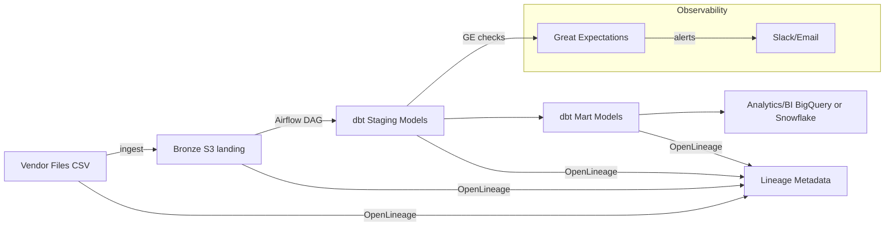

# Mini Telecom ETL
Production-style **ETL template** for telecom (or any event) data using **Airflow → dbt → Great Expectations** with **OpenLineage** and a sprinkle of **IaC**. Built to *show, not tell* your ETL chops: idempotency, SLAs, testing, lineage, and backfills.

<p align="left">
  <a href="#"></a>
  <a href="#"></a>
  <a href="#"></a>
  <a href="#"></a>
  <a href="#"></a>
</p>

---

## ✨ Why this repo exists
Hiring teams want proof of **real-world ETL** skills. This repo demonstrates:
- **Idempotent ingest** (dedupe by business key; safe backfills)
- **Airflow orchestration** with retries and clear task boundaries
- **dbt** staging + marts with **tests** and simple dimensional modeling
- **Great Expectations** data contracts (freshness + nulls + ranges)
- **OpenLineage** config for lineage capture
- **Terraform** snippet for a landing bucket
- A minimal **UPSERT** pattern via an integration test

Mermaid diagram of the flow:



---

## 🧱 Repo layout
```
mini-telecom-etl/
├─ data/sample/events.csv
├─ ingest/batch_loader.py
├─ orchestration/airflow/dags/telecom_kpi_pipeline.py
├─ transform/dbt_project.yml
├─ transform/macros/truncate_grain.sql
├─ transform/models/staging/stg_tower_events.sql
├─ transform/models/staging/schema.yml
├─ transform/models/marts/fct_tower_kpi.sql
├─ transform/models/marts/schema.yml
├─ transform/models/marts/kpi/dim_sites.sql             # legacy example
├─ transform/models/marts/kpi/fct_network_kpi.sql      # legacy example
├─ observability/great_expectations/expectations/events_suite.json
├─ observability/lineage/openlineage.yml
├─ infra/terraform/main.tf
├─ tests/integration/test_idempotent_merge.py
├─ docker-compose.yml
├─ .env.example
├─ .gitignore
├─ LICENSE
├─ CONTRIBUTING.md
└─ README.md
```

---

## 🚀 Quickstart (local demo)

> This repo is designed to be **cloud-agnostic**. Swap S3/BigQuery/Snowflake to your environment as needed.

**Option A — Just run the ingest locally**  
```bash
python ingest/batch_loader.py --csv data/sample/events.csv --out data/bronze
```

**Option B — Kick the tires on the Airflow DAG (placeholders)**  
1. Install Airflow (or use the provided `docker-compose.yml` to spin it up).  
2. Open `orchestration/airflow/dags/telecom_kpi_pipeline.py`.  
3. Replace `echo 'dbt ...'` and `echo 'great_expectations ...'` with your local CLI commands.  
4. Trigger the DAG; inspect task logs and timings.  

**dbt models**  
- Staging cleans types and names (`stg_events.sql`).  
- Marts include a tiny dimension (`dim_sites`) and KPI fact (`fct_network_kpi`).  
- Add your profiles as needed (`transform/dbt_project.yml` references `mini_telecom`).

**Great Expectations**  
- Minimal suite under `observability/great_expectations/expectations/events_suite.json`.  
- Add checkpoints and a datasource for your environment.

**Integration Test (UPSERT / Idempotent Merge)**  
```bash
python -m pytest -q tests/integration/test_idempotent_merge.py
```

---

## 🧪 Key Highlights
- **SLAs + freshness**: define targets (e.g., on-time 99.7%, <20m freshness).  
- **Idempotency + backfills**: business key dedupe; late/duplicate event strategy; safe historical replays.  
- **Data quality**: GE + dbt tests (not_null, uniqueness, ranges); alerts on drift.  
- **Lineage**: OpenLineage captures from ingest→staging→marts; enables impact analysis.  
- **Cost/perf**: file sizing, partition pruning, clustering, small-file compaction.  

---

## 🔧 Configure (optional)
Copy `.env.example` to `.env` and populate secrets (if you enable OpenLineage/Slack or real cloud resources). For S3, wire up the Terraform in `infra/terraform/main.tf`.

---

## 🤝 Contributing
See [CONTRIBUTING.md](CONTRIBUTING.md).

## 📄 License
[MIT](LICENSE)

